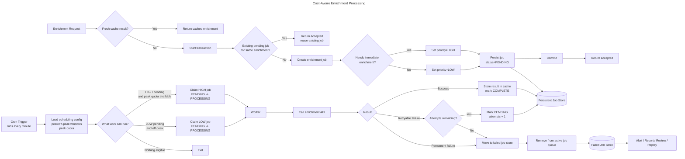

# Cost-Aware Enrichment Processing

## Overview

The platform currently calls the third-party enrichment API in real time whenever user activity triggers a request. This leads to a high number of API calls during peak hours, when the provider charges a premium rate.

Not every enrichment request requires an immediate response. Many are background tasks where a delay of a few hours is acceptable.

This design adds a small scheduling layer between the application and the enrichment provider. Requests are still accepted immediately, but non-urgent enrichment work is queued and processed during off-peak hours. Urgent enrichment continues to run as soon as possible.

The design also adds request deduplication, an enrichment cache, configurable peak and off-peak windows, a peak-time quota, and a separate failed job store for jobs that cannot be processed through the normal path.

## Flow diagram



## Proposed architecture

The system has seven main parts:

| Component | Purpose |
|---|---|
| Request handler | Receives enrichment requests from application activity |
| Enrichment cache | Stores recent enrichment results and avoids repeat provider calls |
| Deduplication check | Prevents duplicate pending jobs for the same enrichment work |
| Persistent job store | Stores active and completed jobs, status, priority, attempts, and lock information |
| Cron scheduler | Runs every minute and checks whether work is eligible |
| Worker | Claims jobs and calls the third-party enrichment API |
| Failed job store | Separately stores jobs that cannot be processed through the normal path |

The key change is that the application no longer calls the provider immediately for every enrichment request.

The request path first checks whether the enrichment data already exists in cache. If a fresh cached result is found, the system can return it without calling the provider.

If there is no cache hit, the system checks whether the same enrichment work is already pending. If so, it reuses the existing job instead of creating another provider call.

Only after those checks does the system create a new enrichment job.

High-priority jobs can be processed as soon as the worker sees them, subject to any configured peak-time quota. Low-priority jobs are only processed during the off-peak pricing window.

## Configuration

Peak and off-peak rules should be configurable rather than hard-coded.

Example configuration:

```yaml
enrichment:
  peak_hours:
    timezone: Europe/London
    windows:
      - start: "08:00"
        end: "18:00"
        days: ["Mon", "Tue", "Wed", "Thu", "Fri"]

  peak_quota:
    max_requests_per_hour: 1000

  cache:
    ttl_hours: 24

  worker:
    cron_frequency: "* * * * *"
    max_attempts: 5
```

The important configurable values are:

| Setting | Purpose |
|---|---|
| Peak/off-peak windows | Defines when premium provider pricing applies |
| Timezone | Ensures pricing windows match the provider’s market definition |
| Peak quota | Caps how many high-priority calls can be made during peak periods |
| Cache TTL | Defines how long enrichment data can be reused |
| Max attempts | Controls retry behaviour before a job is moved to the failed job store |

## End-to-end flow

1. The application receives an enrichment request.
2. It checks whether a fresh enrichment result already exists in cache.
3. If the cache has a fresh result, the cached enrichment is returned.
4. If there is no cache hit, the system starts a transaction.
5. It checks whether an equivalent pending job already exists.
6. If an equivalent job exists, the request is accepted without creating duplicate work.
7. If no equivalent job exists, the system creates an enrichment job.
8. It decides whether the request needs immediate enrichment.
9. It sets the job priority:
   - `HIGH` if the enrichment is needed as soon as possible.
   - `LOW` if the enrichment can wait until off-peak.
10. The job is persisted with `status=PENDING`.
11. The transaction commits.
12. The application returns `accepted`.

A cron trigger runs every minute and checks for eligible work.

The worker can process:

- `HIGH` priority jobs whenever they are pending, subject to the peak quota.
- `LOW` priority jobs only during the off-peak window.

If no work is eligible, the worker exits.

When a job is selected, the worker claims it by changing its state from `PENDING` to `PROCESSING`. It then calls the enrichment API, stores the result in the enrichment cache, and marks the job as `COMPLETE`.

If the job fails temporarily, it is returned to `PENDING` and retried until the maximum attempt count is reached.

If the job keeps failing, or fails for a permanent reason, it is moved out of the active job store and into the separate failed job store.

## Request deduplication

Deduplication prevents the system from creating multiple jobs for the same enrichment work.

For example, if 100 users trigger enrichment for the same entity whithin a short window, the platform should not create 100 third-party API calls. It should create one job and allow later requests to reuse the same pending work.

A deduplication key could be based on:

```text
provider
enrichment_type
entity_id
normalised_request_payload
```

The job store should enforce this with a unique constraint for active jobs.

For example:

```text
dedupe_key
status in PENDING / PROCESSING
```

Once the job completes, the result should be stored in the enrichment cache so later requests can avoid both job creation and provider calls.

## Enrichment cache

The enrichment cache stores successful provider responses.

The cache should be keyed by the same logical enrichment identity used for deduplication. For example:

```text
provider
enrichment_type
entity_id
normalised_request_payload
```

The cache needs a freshness rule. Some enrichment data may be safe to reuse for 24 hours, while other data might require a shorter TTL.

A cache hit avoids a third-party API call entirely, which reduces both peak and off-peak costs.

A cache miss does not always mean the provider should be called right away. If the enrichment is not urgent, the request should still create a low-priority job and wait for off-peak processing.

## Job states

Jobs in the main job store should use explicit states:

| State | Meaning |
|---|---|
| `PENDING` | Waiting to be processed |
| `PROCESSING` | Claimed by a worker |
| `COMPLETE` | Finished successfully |

Jobs that cannot be processed are moved to the separate failed job store.

This keeps the main job store focused on normal processing while making failed jobs easier to monitor and report on.

## Reliability and avoiding request loss

The system should not acknowledge accepted work until the job has been stored.

This prevents the failure case where the application returns success but crashes before the enrichment request is saved.

Workers should claim jobs atomically. This prevents two workers from processing the same job at once.

A job should also have lock fields such as `locked_at`, `locked_by`, and `lock_expires_at`. If a worker crashes after claiming a job, the lock can expire and another worker can reclaim it.

Processing should be idempotent. A retry, timeout, or worker crash may cause the same job to run more than once. Running the same job twice should not create duplicate records or corrupt enrichment data.

Jobs that cannot be processed are moved to the failed job store. This prevents poison jobs from being retried forever while preserving the payload, error, and context needed for reporting, debugging, and replay.

The move to the failed job store should be transactional where possible. The system should not lose the job between removing it from normal processing and recording it for review.

## Failed job store (Dead letter queue)

The failed job store is a separate reporting and review surface for jobs that cannot be processed through the normal worker path.

This includes:

- jobs that exceed the maximum retry count
- jobs rejected by the provider for a permanent reason
- malformed or unsupported enrichment payloads
- jobs that repeatedly trigger worker errors

A failed job should retain:

| Field | Purpose |
|---|---|
| `failed_job_id` | Unique failed job record identifier |
| `job_id` | Original job identifier |
| `payload` | Request data needed for inspection or replay |
| `priority` | Whether the job was high or low priority |
| `attempts` | Number of failed attempts |
| `last_error` | Most recent failure reason |
| `failed_at` | When it entered the failed job store |
| `failure_type` | Timeout, provider error, validation issue, worker error, etc. |

Failed jobs should not be picked up by normal workers. They should require manual review, an explicit replay action, or a separate controlled reprocessing flow.

Keeping these records in a separate store makes it easier to monitor whether failed jobs are growing, alert on unusual spikes, and report on common failure causes.

## Trade-offs and failure modes

| Issue | Consideration |
|---|---|
| Delayed enrichment | Low-priority results may arrive hours later |
| Eventual consistency | The application must handle pending enrichment states |
| Cache staleness | Cached enrichment may be out of date within the TTL window |
| Duplicate suppression risk | Deduplication keys must be precise enough not to merge different requests |
| Queue growth | The off-peak window must have enough capacity to clear the backlog |
| Peak spend remains | Urgent jobs may still call the API during premium-rate periods |
| Peak quota exhaustion | Some urgent jobs may be delayed or require alerting/escalation |
| Worker crash | Locks or leases allow stuck jobs to be reclaimed |
| API failure | Retry temporary failures and move repeated failures to the failed job store |
| Poison jobs | Failed job store prevents repeated failure loops |
| Duplicate processing | Idempotent processing prevents duplicate side effects |
| Scheduler failure | Alert if cron stops running or no jobs are processed for too long |
| Failed job move failure | Move to the failed job store transactionally to avoid losing failed jobs |
| Config error | Wrong peak/off-peak settings could shift work into premium-rate windows |

## Monitoring

The system should track:

- cache hit rate
- deduplication hit rate
- pending jobs by priority
- oldest pending low-priority job
- jobs processed per minute
- retried jobs
- failed jobs
- failed job growth rate
- common failure types
- peak vs off-peak API call volume
- peak quota usage
- estimated API cost by pricing window

These metrics show whether the system is reducing provider calls, shifting non-urgent API usage away from premium-rate hours, and whether failed jobs are growing faster than expected.

## Summary

This design reduces peak-hour API spend by avoiding unnecessary enrichment calls and moving non-urgent calls into an off-peak processing window.

The request path first checks the enrichment cache, then deduplicates against existing pending work, then creates a job only when needed.

High-priority jobs run as soon as possible, subject to peak-time quota controls. Low-priority jobs wait until off-peak.

Reliability is maintained by persisting jobs before acknowledgement, using explicit job states, atomically claiming work, retrying temporary failures, and moving exhausted or poison jobs to a separate failed job store for reporting, review, and controlled replay.